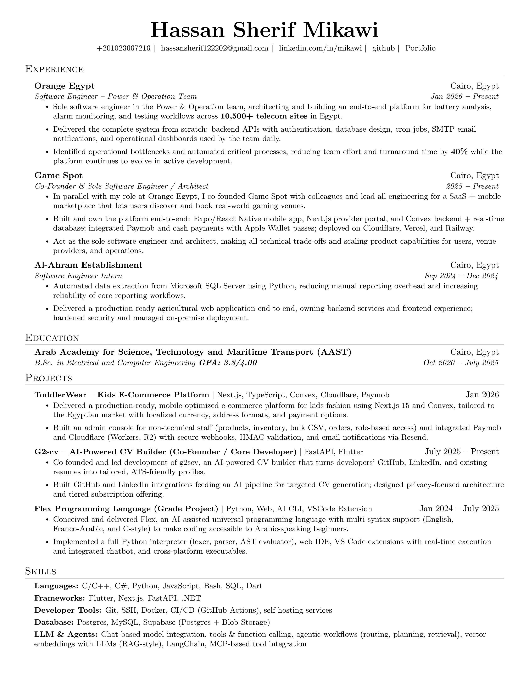

# Hassan-Mikawi-CV

My curriculum vitae (CV) written using LaTeX. In my CV, you can find my contact information, websites, education, experience, achievements, projects, and skills.

Please find attached my [CV](https://drive.google.com/file/d/1-6-QggAd16zm_JDZumBXnqX62kKCH7pl/view). 😜

## Run on Terminal

```sh
make
```

## CI/CD Pipeline

This repository uses GitHub Actions to automatically generate the CV PDF and PNG image whenever changes are pushed to the `main` branch. The workflow:

1. Compiles the LaTeX file (`mikawi_CV.tex`) to PDF using `pdflatex`
2. Converts the PDF to a high-quality PNG image using ImageMagick
3. Automatically commits and pushes the generated files back to the repository

The workflow runs on GitHub's servers, so you don't need to have LaTeX or ImageMagick installed locally to generate the CV files.

## Screenshots

<p align="center">
    
</p>

## Author

👤 **Hassan Mikawi**

* LinkedIn: [Hassan Mikawi](https://www.linkedin.com/in/hassan-mikawi-1314b9238/)
* GitHub: [@Hassan220022](https://github.com/Hassan220022)
