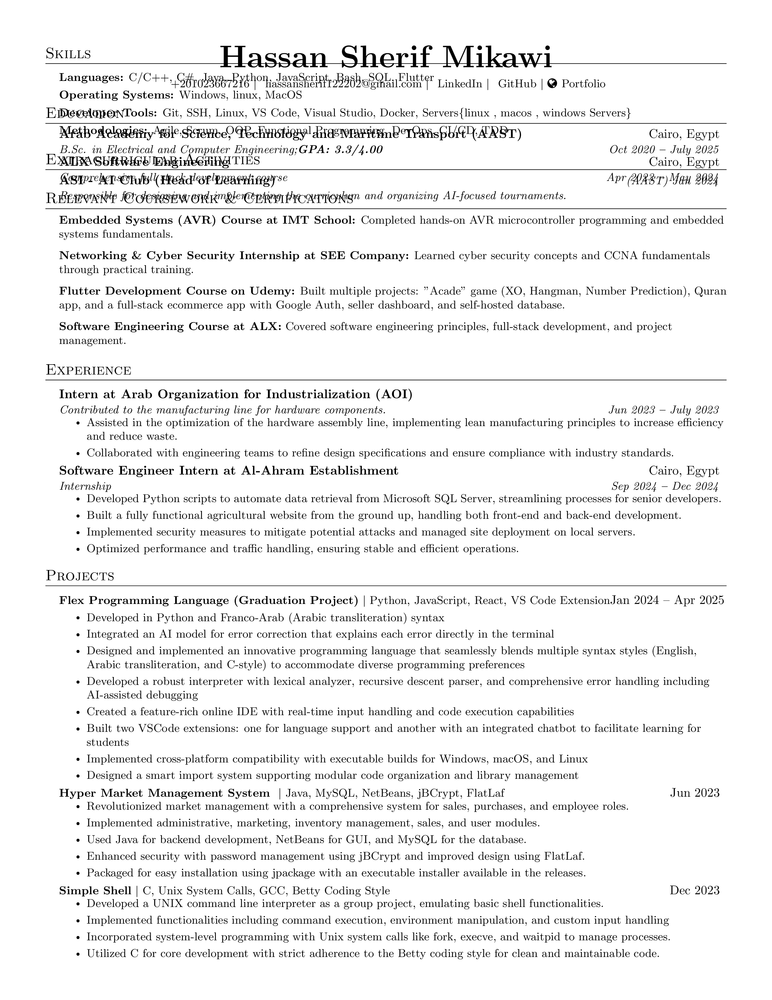

# Hassan-Mikawi-CV

My curriculum vitae (CV) written using LaTeX. In my CV, you can find my contact information, websites, education, experience, achievements, projects, and skills.

Please find attached my [CV](https://drive.google.com/file/d/1-6-QggAd16zm_JDZumBXnqX62kKCH7pl/view). 😜

## Run on Terminal

```sh
make
```

## Screenshots

<p align="center">
    
</p>

## Author

👤 **Hassan Mikawi**

* LinkedIn: [Hassan Mikawi](https://www.linkedin.com/in/hassan-mikawi-1314b9238/)
* GitHub: [@Hassan220022](https://github.com/Hassan220022)
